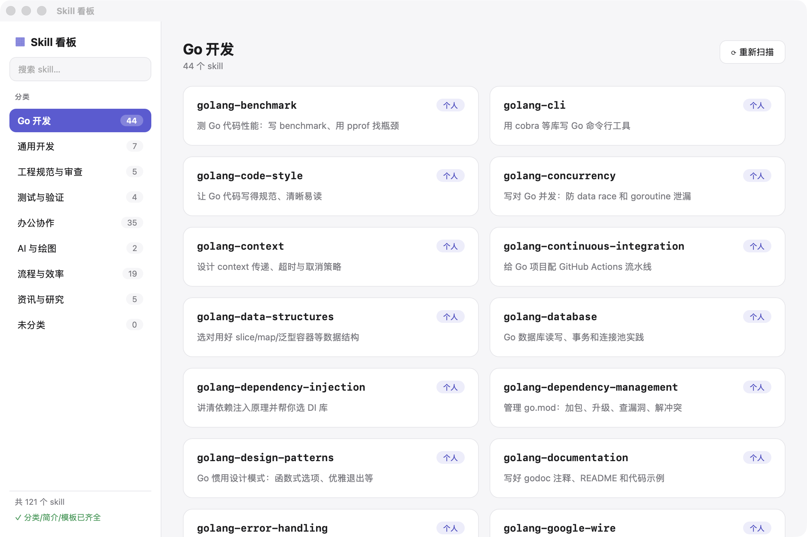
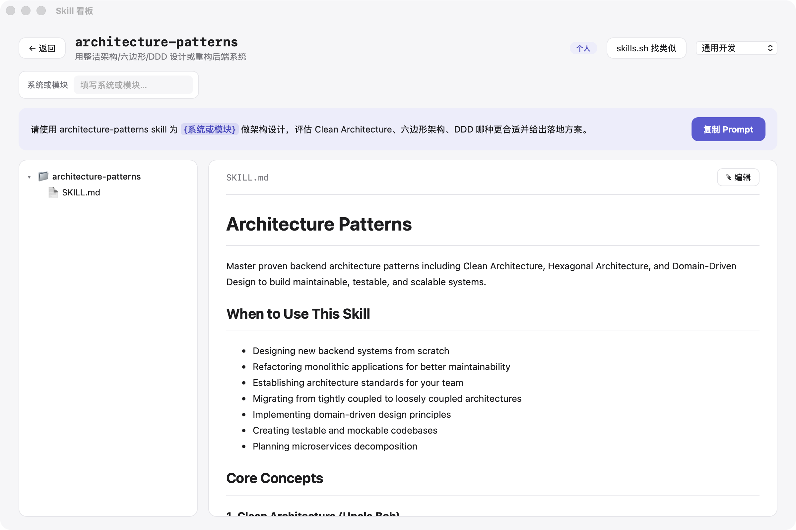
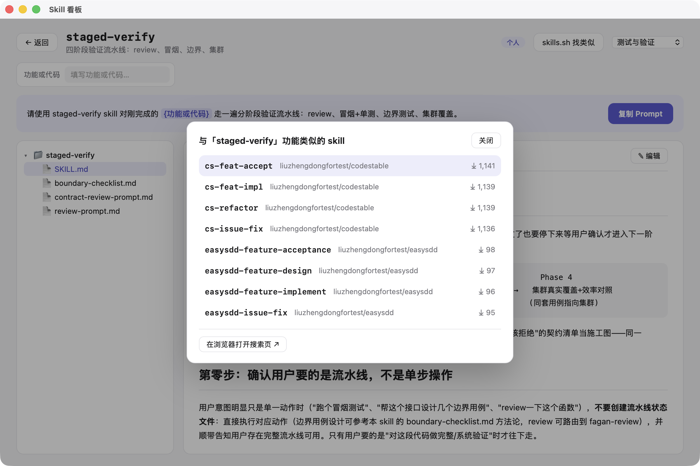

# Skill Hub（skill-hub）

macOS 桌面应用：把散落在本地各处的 AI Agent skill（Claude Code、Codex、跨平台 Agents 库）收进一个可视化看板——分类浏览、一句话看懂每个 skill 能干什么、填参数生成即用 prompt、在线找类似 skill、直接编辑源文件。

基于 Tauri 2 + React，dmg 体积约 3MB，数据每次启动实时扫描本地文件，无任何后端服务。



## 功能

- **多来源实时扫描**（每次启动/点「重新扫描」现读文件系统，无缓存库）：
  | 目录 | 来源 badge |
  |---|---|
  | `~/.claude/skills/` | 个人 |
  | `~/.claude/plugins/cache/**/skills/` | 插件名（多版本自动去重，取最新） |
  | `~/.agents/skills/`（跨平台 Agent Skills 中央库） | Agents 库 |
  | `~/.codex/skills/` | Codex |
- **中文分类侧栏**：Go 开发 / 通用开发 / 工程规范与审查 / 测试与验证 / 办公协作 / AI 与绘图 / 流程与效率 / 资讯与研究，带计数；新 skill 自动按规则归类，兜不住进「未分类」，详情页下拉可手动调整（写回配置）
- **人话简介**：SKILL.md 里的 description 是写给模型路由看的长文本，卡片上展示的是预生成的一句话中文简介
- **Prompt 模板 + 参数填写**：每个 skill 一条针对性模板，`{占位符}` 自动变成输入框，填完实时替换高亮，「复制 Prompt」拿到即用的完整 prompt，粘到终端就能跑
- **目录结构与文件预览**：详情页左侧文件树，markdown 渲染（自动剥 frontmatter），任意文件可看
- **编辑保存回源文件**：点「✎ 编辑」直接改，保存写回真实 skill 文件（仅限 skill 目录白名单内，防路径穿越）
- **skills.sh 语义找类似**：用 skill 的 description 做语义搜索（中文也有效），弹层展示最相关的 8 个（含 GitHub 仓库和安装量），点击跳浏览器
- **全局搜索**：名称 / 描述 / 简介模糊匹配





## 安装

到 [Releases](../../releases) 下载 `skill-hub_x.x.x_aarch64.dmg`（Apple Silicon），拖入「应用程序」。

> **首次打开提示"无法验证开发者"**：应用未做 Apple 签名公证，属正常。两种解法任选：
> - 在「应用程序」里**右键 → 打开 → 打开**（只需一次）
> - 或终端执行：`xattr -cr /Applications/skill-hub.app`

## 从源码构建

依赖：Node 18+、Rust 工具链（`curl --proto '=https' --tlsv1.2 -sSf https://sh.rustup.rs | sh`）。

```bash
git clone https://github.com/yaofuhong0311/skill-hub.git
cd skill-hub
npm install
npm run tauri dev     # 开发模式
npm run tauri build   # 产出 dmg：src-tauri/target/release/bundle/dmg/
```

跑测试：`cd src-tauri && cargo test`（frontmatter 解析、真实目录扫描、写入护栏）。

## 使用流程

1. 左侧点分类（或顶部搜索）→ 右侧卡片看简介
2. 点卡片进详情页 → 上方填 `{占位符}` 参数 → 「复制 Prompt」→ 粘到 Claude Code / Codex 终端
3. 想看实现：左侧文件树点任意文件预览；想改：「✎ 编辑」→「保存」直接写回源文件
4. 想找社区替代品：「skills.sh 找类似」语义搜索
5. 装了新 skill：点侧栏「重新扫描」

## 换一台电脑 / 分享给别人：配置怎么补全

应用**不内置任何具体 skill 的配置**——只带一套分类框架和归类规则。分类、简介、模板都是每个人针对自己本机的 skill 现生成的，存在各自的用户目录里。所以第一次用（或装了新 skill）：

1. 打开应用，侧栏底部会出现 **「⚙ 补全配置 Prompt（N）」** 按钮（N = 缺配置的 skill 数；配置齐全时这里显示「✓ 分类/简介/模板已齐全」）
2. 点击复制出一段 prompt，**粘到你常用的 AI 编程助手里执行**（Claude Code、Codex CLI、Cursor 等都行，指令本身只是读 SKILL.md、写三份 JSON）
3. 回到应用点「重新扫描」，你**自己的**分类和简介即生效

> 在生成配置前，卡片会用 SKILL.md 描述兜底显示、按规则粗略归类，功能不受影响。

用户配置目录（增量覆盖内置默认，可手工编辑）：

```
~/Library/Application Support/skill-hub/
├── categories.json   # 分类定义 + skill→分类映射
├── summaries.json    # skill→一句话简介
└── templates.json    # skill→prompt 模板
```

## 项目结构

```
src/                  # React 前端（分类/卡片/详情/弹层）
src-tauri/src/lib.rs  # 全部 Rust 逻辑：扫描、文件读写、配置、skills.sh 搜索
config/               # 内置默认配置（categories/summaries/templates）
docs/SDD.md           # 设计决策与变更记录
```

## 技术说明

- 文件访问全部走 Rust command，路径经 canonicalize + 白名单校验
- skills.sh 搜索走 Rust 侧 HTTP（`GET https://www.skills.sh/api/search?q=`，语义匹配），避开 webview CORS；断网时该功能优雅降级，其余功能不受影响
- 无遥测、无账号，所有数据留在本机
